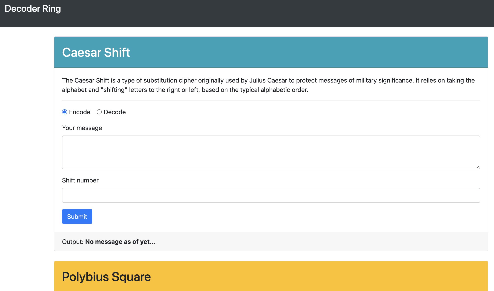

# Library Project

This project is meant to help you encode and decode messages using three different ciphers (caesar, polybius, and substitution). Enter your message in the appropriate field and fill out any other relevant fields before hitting `submit`.

## Screenshot

## Technology

### Built with:

- Javascript
- HTML

## Installation

Follow these steps to set up your project locally:

1.  **Clone the repository**

        git clone https://github.com/tpoole1441/decoder-ring.git

2.  **Navigate to the project directory**

        cd decoder-ring

3.  **Install dependencies**

        npm install

4.  **Start the development server**

        npm start
